# AI-Assisted ETL Pipeline with DuckDB & Prefect
<p align="center">
  
  
  
  
  
  
</p>
---
This repo contains a fully local **AI-assisted ETL/ELT pipeline** built with Python, Prefect, DuckDB, and Pandas. It simulates how modern ETL tools embed LLM-style logic to:
- Propose cleaning and transformation rules
- Generate reusable code
- Build analytics and ML-ready features
- Keep the entire workflow transparent and reproducible

All components run **locally** — no cloud services, no external LLM API calls. The “LLM” is a deterministic Python stub that logs prompts and returns code into `docs/llm_logs/`.

## 🏗 Architecture (High-Level)
```text
         ┌────────────────────────────┐
         │  1. Ingest (Prefect Task) │
         │  Download NYC Yellow Taxi │
         │  CSV → data/raw/          │
         └────────────┬─────────────┘
                      │
                      ▼
         ┌────────────────────────────┐
         │  2. Bronze Layer           │
         │  CSV → Parquet             │
         │  Basic type coercion       │
         │  data/bronze/              │
         └────────────┬─────────────┘
                      │
                      ▼
         ┌────────────────────────────┐
         │  3. LLM-Assisted Transform │
         │  Logs schema + goals       │
         │  Generates transform(df)   │
         └────────────┬─────────────┘
                      │
                      ▼
         ┌────────────────────────────┐
         │  4. Silver Layer           │
         │  pandera validation        │
         │  DuckDB: silver.* tables   │
         └────────────┬─────────────┘
                      │
                      ▼
         ┌────────────────────────────┐
         │  5. Gold (ML Features)     │
         │  gold.taxi_trip_features   │
         │  via SQL materialization   │
         └────────────┬─────────────┘
                      │
                      ▼
         ┌────────────────────────────┐
         │  6. Analytics & Modeling   │
         │  SQL + BI / notebooks      │
         └────────────────────────────┘
```

## 🧭 Architecture (Mermaid Diagram)

```mermaid
flowchart LR
    subgraph Raw["Raw Layer (data/raw)"]
        R1["NYC Yellow Taxi CSV\n data/raw/taxi_sample.csv"]
    end
    subgraph Bronze["Bronze Layer (data/bronze)"]
        B1["Parquet: taxi_sample.parquet"]
    end
    subgraph LLM["LLM-Assisted Transform"]
        L1["suggest_cleaning_code(schema, goal) → code"]
        L2["transform(df) executed in Prefect"]
    end
    subgraph Silver["Silver Layer (data/silver + DuckDB)"]
        S1["Validated Parquet\n data/silver/taxi_sample_clean.parquet"]
        S2["DuckDB table: silver.taxi_sample"]
    end
    subgraph Gold["Gold / Features (DuckDB)"]
        G1["gold.taxi_trip_features"]
    end
    subgraph Analytics["Analytics & ML"]
        A1["SQL analytics (01–03_*.sql)"]
        A2["Notebooks / BI tools"]
    end
    R1 --> B1 --> L1 --> L2 --> S1 --> S2 --> G1 --> A1 --> A2
```


## 🔍 What the Pipeline Does
### 1. Ingest (Raw → CSV)
- Downloads NYC Yellow Taxi sample data  
- Saves: `data/raw/taxi_sample.csv`  
- Implemented in `src/ingest.py` and `orchestration/flow_ingest_transform.py`

### 2. Bronze Layer (Raw → Parquet)
- Reads CSV into Pandas  
- Basic type coercion  
- Writes: `data/bronze/taxi_sample.parquet`

### 3. “LLM-Style” Transform (Bronze → Clean DataFrame)
- `src/llm_assist.py`:
  - Logs schema + cleaning goal to `docs/llm_logs/`
  - Returns Python code defining `transform(df)`
- Prefect flow:
  - Executes the code
  - Applies `transform(df)` to bronze data

### 4. Silver Layer (Validated Parquet)
- Uses `pandera` schema validation (`src/validate.py`)
- Writes: `data/silver/taxi_sample_clean.parquet`
- Loads into DuckDB as `silver.taxi_sample`

### 5. Gold Layer (ML-Ready Features)
- Materialized with `sql/04_ml_features_materialized.sql`
- Table: `gold.taxi_trip_features`
- Features include:
  - duration, speed, tip percentage
  - is_long_trip / is_high_fare
  - morning / afternoon / evening / night buckets

### 6. Analytics (SQL Files)
- `sql/01_*.sql`: analytics examples  
- `sql/02_*.sql`: feature engineering  
- `sql/03_*.sql`: data-quality checks  

## 🧱 Tech Stack
- Python 3.10  
- Prefect 3  
- DuckDB  
- pandas  
- pandera  
- SQL files  
Everything runs **locally**.

## 🗂 Project Structure
```bash
ai-assisted-etl/
├── .gitignore
├── README.md
├── requirements.txt
├── data/
│   ├── .gitkeep
│   ├── raw/
│   ├── bronze/
│   ├── silver/
│   └── gold/
├── docs/
│   └── llm_logs/
│       └── .gitkeep
├── orchestration/
│   └── flow_ingest_transform.py
├── sql/
│   ├── 01_analytics_examples.sql
│   ├── 02_feature_engineering_examples.sql
│   ├── 03_data_quality_checks.sql
│   └── 04_ml_features_materialized.sql
└── src/
    ├── config.py
    ├── ingest.py
    ├── llm_assist.py
    ├── validate.py
    └── warehouse.py
```

